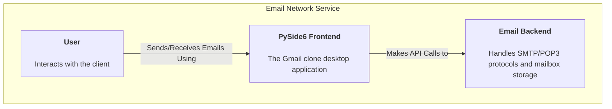
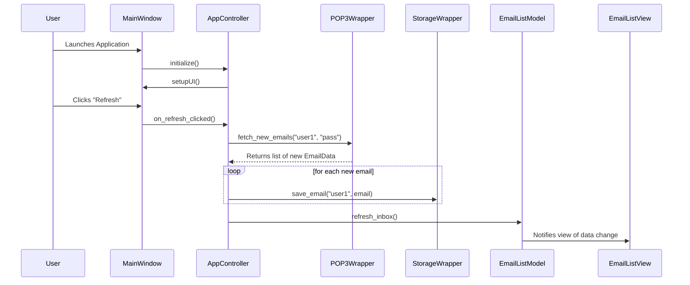
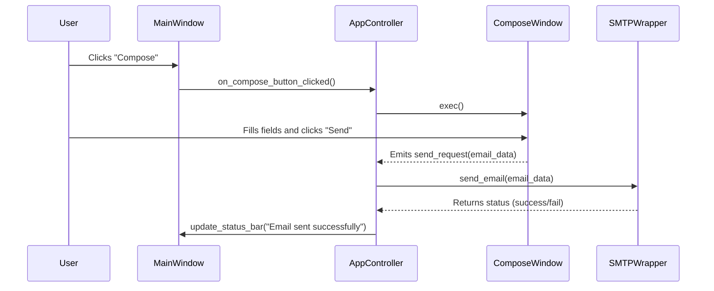
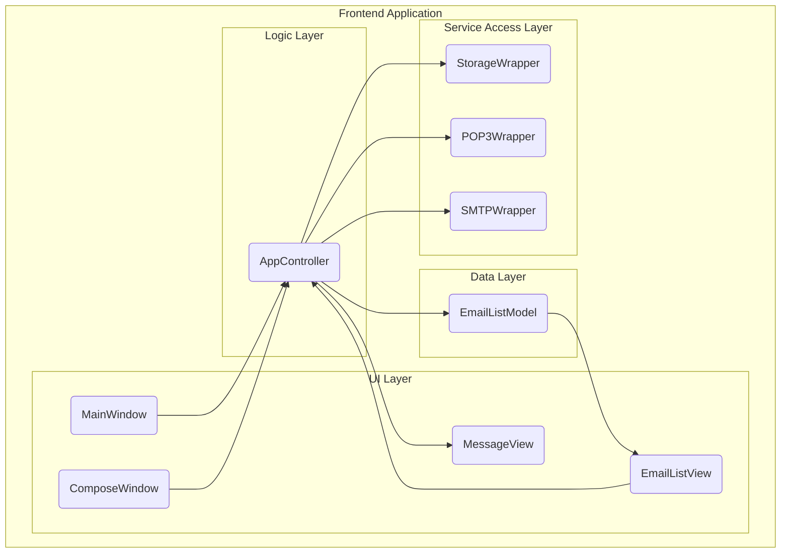

# Software Design Document: PySide6 Gmail Clone Frontend

**Version:** 1.0  
**Date:** 2025-11-25  
**Author:** Gemini  
**Status:** Final

---

## 1. Executive Summary

This document outlines the software design for a new desktop email client with a user interface inspired by Gmail. The frontend will be built using PySide6 and will integrate with the existing `@email-network-service` backend, which provides SMTP, POP3, and local mailbox storage capabilities. The goal is to create a modern, responsive, and intuitive user experience for managing emails, leveraging the project's established network protocols and data storage mechanisms. This SDD provides a complete, implementation-ready blueprint for developers.

## 2. Goals & Non-Goals

### Goals
- To develop a fully functional desktop email client with a GUI.
- To provide core email functionalities: viewing an inbox, reading emails, composing, and sending emails.
- To ensure seamless integration with the existing backend services (`@src/smtp/smtp_client.py`, `@src/pop3/pop3_client.py`, `@src/mailbox/storage_manager.py`).
- To create a responsive and visually appealing UI using PySide6 and a custom QSS theme.
- The application must be packageable into a standalone executable using PyInstaller.

### Non-Goals
- **Real-time Push Notifications:** The client will fetch emails via polling (manual refresh or on a timer), not through real-time server pushes.
- **Advanced Search:** Initial version will not include complex search or filtering capabilities beyond simple text matching in the subject/sender.
- **Web or Mobile Version:** This SDD is strictly for a desktop application.
- **Cloud Sync:** User data, settings, and mailboxes are stored locally. There is no cloud synchronization.
- **Calendar, Tasks, or Chat:** The application is focused solely on email functionality.

## 3. UX / Wireframes

The UI will be clean, modern, and familiar to users of webmail clients like Gmail.

### Main Window Wireframe (ASCII)

```
+--------------------------------------------------------------------------------------------------+
| Gmail Clone                                                                 [User: user1@localhost] |
+--------------------------------------------------------------------------------------------------+
| | COMPOSE |        |                                                                             |
| +---------+        |                                                                             |
| | Inbox   |        |  From: sender@example.com                                                   |
| | Sent    |        |  To: user1@localhost                                                        |
| | Drafts  |        |  Date: 2025-11-25 10:30:00                                                  |
| | Trash   |        |  Subject: Important Update                                                  |
| +------------------+ +---------------------------------------------------------------------------+|
| | sender@example.com |                                                                             |
| | Important Update   |  <-- QWebEngineView rendering email body (HTML or plain text) -->          |
| | 10:30 AM           |                                                                             |
| +------------------+                                                                             |
| | another@sender.com |                                                                             |
| | Meeting Reminder   |                                                                             |
| | 09:15 AM           |                                                                             |
| +------------------+                                                                             |
| | ... (email list) |                                                                             |
| |                  |                                                                             |
| +------------------+---------------------------------------------------------------------------+|
| Status: Ready | 2 unread messages                                         | [REFRESH]          |
+--------------------------------------------------------------------------------------------------+
```

### Compose Window Wireframe (ASCII)

```
+--------------------------------------------------------------------------+
| Compose New Message                                                      |
+--------------------------------------------------------------------------+
| To:      [ recipient@domain.com                                     ]   |
| Cc:      [                                                          ]   |
| Bcc:     [                                                          ]   |
| Subject: [                                                          ]   |
+--------------------------------------------------------------------------+
|                                                                          |
| [ Message body text area (supports plain text)                         ] |
|                                                                          |
|                                                                          |
|                                                                          |
|                                                                          |
|                                                                          |
+--------------------------------------------------------------------------+
| [ SEND ] [ Attach File ] [ Discard ]                                    |
+--------------------------------------------------------------------------+
```

## 4. Architecture Overview (C4-style)

The architecture follows a Model-View-Controller (MVC) pattern, separating UI, data, and business logic.

### Level 1: System Context



### Level 2: Container Diagram

```mermaid
graph TD
    subgraph "Desktop Application"
        A["<div style=\"font-weight:bold\">PySide6 UI (Container)</div><br/>Presents inbox, messages, and composer.<br/>[Python, PySide6]"]
    end

    subgraph "Backend System (Existing)"
        B["<div style=\"font-weight:bold\">Mailbox Storage (Container)</div><br/>File-system based email storage.<br/>[@database/mailboxes]"]
        C["<div style=\"font-weight:bold\">SMTP Service (Container)</div><br/>Sends email via SMTP protocol.<br/>[@src/smtp/smtp_server.py]"]
        D["<div style=\"font-weight:bold\">POP3 Service (Container)</div><br/>Retrieves email via POP3 protocol.<br/>[@src/pop3/pop3_server.py]"]
    end

    A -- "Reads/Writes Emails from/to" --> B
    A -- "Sends Email via" --> C
    A -- "Fetches Email via" --> D
```

### Level 3: Component Diagram

```mermaid
graph TD
    subgraph "PySide6 Frontend"
        subgraph "View (UI Components)"
            MainWindow["<div style=\"font-weight:bold\">MainWindow</div><br/>Main application window"]
            EmailListView["<div style=\"font-weight:bold\">EmailListView</div><br/>QListView for inbox"]
            MessageView["<div style=\"font-weight:bold\">MessageView</div><br/>QWebEngineView for email body"]
            ComposeWindow["<div style=\"font-weight:bold\">ComposeWindow</div><br/>Dialog for writing emails"]
        end

        subgraph "Model (Data & State)"
            EmailListModel["<div style=\"font-weight:bold\">EmailListModel</div><br/>QAbstractListModel for email list"]
            EmailData["<div style=\"font-weight:bold\">EmailData</div><br/>Data class for a single email"]
        end

        subgraph "Controller (Logic)"
            AppController["<div style=\"font-weight:bold\">AppController</div><br/>Handles signals, business logic"]
        end

        subgraph "Backend Wrappers"
            StorageWrapper["<div style=\"font-weight:bold\">StorageWrapper</div><br/>Interfaces with @src/mailbox/storage_manager.py"]
            SMTPWrapper["<div style=\"font-weight:bold\">SMTPWrapper</div><br/>Interfaces with @src/smtp/smtp_client.py"]
            POP3Wrapper["<div style=\"font-weight:bold\">POP3Wrapper</div><br/>Interfaces with @src/pop3/pop3_client.py"]
        end
    end

    AppController -- "Updates" --> EmailListModel
    AppController -- "Shows/Hides" --> ComposeWindow
    AppController -- "Displays Content In" --> MessageView
    EmailListView -- "Displays Data From" --> EmailListModel
    MainWindow -- "Contains" --> EmailListView
    MainWindow -- "Contains" --> MessageView

    AppController -- "Uses" --> StorageWrapper
    AppController -- "Uses" --> SMTPWrapper
    AppController -- "Uses" --> POP3Wrapper
```

## 5. UI Components & Responsibilities

- **`MainWindow` (main_window.py):** The main application container. Manages the layout of all other components, including the toolbar, email list, and message view pane.
- **`EmailListView` (views.py):** A `QListView` subclass that displays the list of emails from the `EmailListModel`. It will use a custom delegate to render each item with sender, subject, and timestamp.
- **`MessageView` (views.py):** A `QWebEngineView` widget that renders the content of the selected email. It will be responsible for safely displaying HTML and plain text content.
- **`ComposeWindow` (views.py):** A `QDialog` that provides fields for recipient(s), subject, and a text area for the message body. It emits a signal with the composed email data upon sending.
- **`StatusBar` (main_window.py):** A `QStatusBar` at the bottom of the `MainWindow` to display application status, unread counts, and error messages.

## 6. Data Models

- **`EmailData` (models.py):** A dataclass or simple Python class representing a single email message. It will parse and hold data from the raw email file (`.txt` files in `@database/mailboxes/<user>/`).
  ```python
  from dataclasses import dataclass
  from email.message import Message

  @dataclass
  class EmailData:
      uid: str
      sender: str
      recipient: str
      subject: str
      date: str
      body_html: str | None
      body_text: str
      raw_message: Message
  ```
- **`EmailListModel` (models.py):** A `QAbstractListModel` subclass that serves as the data source for the `EmailListView`. It will hold a list of `EmailData` objects and notify the view of any changes (e.g., new emails arriving). It will implement `rowCount()`, `data()`, and custom methods like `refresh_inbox()`.

## 7. Controllers & Signal Flows

- **`AppController` (controllers.py):** The central hub for application logic. It connects UI signals to backend operations.
  - **`on_compose_button_clicked()`:** Creates and shows the `ComposeWindow`.
  - **`on_send_email(email_data)`:** Receives the composed email from `ComposeWindow`, calls the `SMTPWrapper` to send it, and provides feedback to the user via the status bar.
  - **`on_email_selected(index)`:** Triggered when a user clicks an email in `EmailListView`. It fetches the full email content using `StorageWrapper` and tells `MessageView` to render it.
  - **`on_refresh_clicked()`:** Calls the `POP3Wrapper` to check for new mail. If new mail is found, it uses `StorageWrapper` to save it and updates the `EmailListModel`, which automatically refreshes the `EmailListView`.

## 8. Integration Points

The frontend will reside in a new directory `email-network-service/src/client/frontend/` and will interface with the existing backend modules.

- **Reading Mailbox (`StorageWrapper`):**
  - **File:** `email-network-service/src/client/frontend/wrappers.py`
  - **Integration:** This wrapper will import and use the (yet to be implemented) functions in `@email-network-service/src/mailbox/storage_manager.py`.
  - **Functionality:**
    - `list_emails(user: str) -> List[str]`: Returns a list of email UIDs from the user's mailbox directory (`@database/mailboxes/<user>/`).
    - `get_email(user: str, uid: str) -> EmailData`: Reads a specific email file (e.g., `@database/mailboxes/user1/email_0001.txt`), parses it into an `EmailData` object, and returns it.

- **Sending Email (`SMTPWrapper`):**
  - **File:** `email-network-service/src/client/frontend/wrappers.py`
  - **Integration:** This wrapper will use the client class from `@email-network-service/src/smtp/smtp_client.py`.
  - **Functionality:**
    - `send_email(sender: str, recipients: List[str], message: str)`: Creates an instance of the `SMTPClient`, connects to the SMTP server, and executes the `HELO`, `MAIL FROM`, `RCPT TO`, `DATA` command sequence.

- **Fetching Email (`POP3Wrapper`):**
  - **File:** `email-network-service/src/client/frontend/wrappers.py`
  - **Integration:** This wrapper will use the client class from `@email-network-service/src/pop3/pop3_client.py`.
  - **Functionality:**
    - `fetch_new_emails(user: str, password: str) -> List[EmailData]`: Creates an instance of `POP3Client`, connects to the POP3 server, authenticates, lists new messages, retrieves them (`RETR`), and then calls `StorageWrapper` to save them to the local mailbox. It will also handle deleting them from the server after successful retrieval using `DELE`.

## 9. Complete QSS Theme

A dark theme inspired by modern IDEs and mail clients will be used. This will be saved in `email-network-service/src/client/frontend/assets/theme.qss`.

```qss
/* Gmail Clone Dark Theme */
QMainWindow, QDialog {
    background-color: #2B2B2B;
    color: #D3D3D3;
}

QListView {
    background-color: #3C3F41;
    border: 1px solid #4A4A4A;
    font-size: 14px;
}

QListView::item {
    padding: 10px;
    border-bottom: 1px solid #4A4A4A;
}

QListView::item:selected {
    background-color: #4B6EAF;
    color: #FFFFFF;
}

QWebEngineView {
    background-color: #313335;
    border: 1px solid #4A4A4A;
}

QPushButton {
    background-color: #4B6EAF;
    color: #FFFFFF;
    border: none;
    padding: 10px 20px;
    border-radius: 4px;
    font-weight: bold;
}

QPushButton:hover {
    background-color: #5A82D1;
}

QPushButton:pressed {
    background-color: #3A5F9E;
}

QLineEdit, QTextEdit {
    background-color: #3C3F41;
    color: #D3D3D3;
    border: 1px solid #4A4A4A;
    border-radius: 4px;
    padding: 5px;
}

QLabel {
    color: #D3D3D3;
    font-size: 14px;
}

QStatusBar {
    background-color: #3C3F41;
    color: #D3D3D3;
}
```

## 10. Detailed Sequence Diagrams (Mermaid)

### App Startup and Fetching Emails


### Composing and Sending an Email


## 11. Component Diagrams (Mermaid)

This diagram shows the primary frontend components and their relationships.



## 12. Example PySide6 Code Snippets

### `run_frontend.py` (New Entry Point)
```python
import sys
from PySide6.QtWidgets import QApplication
from client.frontend.main_window import MainWindow

def main():
    app = QApplication(sys.argv)
    
    # Load QSS theme
    with open("src/client/frontend/assets/theme.qss", "r") as f:
        app.setStyleSheet(f.read())

    window = MainWindow()
    window.show()
    sys.exit(app.exec())

if __name__ == "__main__":
    main()
```

### `main_window.py`
```python
from PySide6.QtWidgets import QMainWindow, QWidget, QVBoxLayout, QHBoxLayout, QPushButton, QListView, QStatusBar
from .views import MessageView
from .controllers import AppController

class MainWindow(QMainWindow):
    def __init__(self):
        super().__init__()
        self.setWindowTitle("Gmail Clone")
        self.setGeometry(100, 100, 1200, 800)

        # Central widget and layout
        central_widget = QWidget()
        self.setCentralWidget(central_widget)
        main_layout = QHBoxLayout(central_widget)

        # Left panel (sidebar and email list)
        left_panel = QWidget()
        left_layout = QVBoxLayout(left_panel)
        self.compose_button = QPushButton("COMPOSE")
        self.email_list_view = QListView()
        left_layout.addWidget(self.compose_button)
        left_layout.addWidget(self.email_list_view)

        # Right panel (message view)
        self.message_view = MessageView()

        main_layout.addWidget(left_panel, 1)
        main_layout.addWidget(self.message_view, 3)

        # Status bar
        self.setStatusBar(QStatusBar(self))

        # Controller
        self.controller = AppController(self)
```

### `models.py` (EmailListModel)
```python
from PySide6.QtCore import QAbstractListModel, Qt

class EmailListModel(QAbstractListModel):
    def __init__(self, *args, emails=None, **kwargs):
        super().__init__(*args, **kwargs)
        self.emails = emails or []

    def rowCount(self, parent):
        return len(self.emails)

    def data(self, index, role):
        if role == Qt.DisplayRole:
            email = self.emails[index.row()]
            return f"{email.sender}\n{email.subject}\n{email.date}"
        # Custom roles can be used for specific data fields
```

## 13. Tests & QA Strategy

- **Unit Tests:** `pytest-qt` will be used to test individual UI components and controller logic in isolation.
  - Test that `EmailListModel` correctly updates when data changes.
  - Test that clicking the "Compose" button opens the `ComposeWindow`.
  - Mock backend wrappers to test controller logic without actual network calls.
- **Integration Tests:**
  - A new test suite in `email-network-service/tests/test_frontend/` will be created.
  - These tests will start the SMTP and POP3 servers in the background, then run the frontend application programmatically.
  - They will simulate user actions (e.g., `qtbot.mouseClick` on the refresh button) and assert that the UI updates correctly after real interactions with the backend.
  - Leverage existing test infrastructure from `@tests/test_smtp/test_smtp_integration.py` and `@tests/test_pop3/test_pop3_integration.py`.

## 14. Performance & Security

- **Performance:**
  - **Lazy Loading:** The full content of an email will only be loaded from disk when the user clicks on it, not all at once on startup.
  - **Pagination:** For mailboxes with thousands of emails, `EmailListModel` can be extended to support incremental loading/pagination.
  - **Responsiveness:** All network operations (sending/fetching) must be performed on background threads (`QThread`) to prevent freezing the UI.
- **Security:**
  - **HTML Sanitization:** The `MessageView` (QWebEngineView) runs in a sandboxed process, which mitigates risks from malicious HTML/JS in emails. However, content can be pre-sanitized before rendering for extra security.
  - **Credentials:** User credentials for the POP3 server should not be stored in plain text. They will be held in memory for the session only. Future versions could use the system's keyring service.

## 15. Accessibility & Keyboard Shortcuts

- **Tab Order:** A logical tab order will be established for all interactive elements.
- **Shortcuts:**
  - `Ctrl+N`: Open Compose window.
  - `Ctrl+R`: Reply to current email.
  - `Ctrl+Shift+R`: Reply-All.
  - `F5`: Refresh inbox.
  - `Del`: Move selected email to Trash.
  - `Up/Down Arrows`: Navigate email list.

## 16. Packaging & Distribution (PyInstaller)

The application will be packaged into a single executable using PyInstaller.

- **Command:**
  ```bash
  pyinstaller --name "GmailClone" \
              --onefile \
              --windowed \
              --add-data "src/client/frontend/assets:assets" \
              src/client/run_frontend.py
  ```
- A `.spec` file will be created for more complex configurations, ensuring assets like the QSS file and icons are included in the final bundle.

## 17. CI/CD Recommendations (GitHub Actions)

A new workflow file will be created at `.github/workflows/frontend-ci.yml`.

```yaml
name: Frontend CI

on:
  push:
    branches: [ main, gmail_clone ]
  pull_request:
    branches: [ main ]

jobs:
  build-and-test:
    runs-on: ubuntu-latest
    steps:
    - uses: actions/checkout@v3

    - name: Set up Python
      uses: actions/setup-python@v4
      with:
        python-version: '3.11'

    - name: Install dependencies
      run: |
        pip install -r requirements.txt
        pip install PySide6 pytest-qt

    - name: Lint with flake8
      run: |
        flake8 src/client/frontend/

    - name: Run Frontend Tests
      run: |
        # Command to run pytest for the frontend module
        pytest tests/test_frontend/
```

## 18. Milestones, Tasks, and Estimates

- **Milestone 1: UI Skeleton & Theming (5 days)**
  - Create `MainWindow`, `ComposeWindow`, and all basic UI components.
  - Implement layout and apply the QSS theme.
  - All UI elements are present but have no logic.
- **Milestone 2: Mailbox Reading & Display (4 days)**
  - Implement `StorageWrapper` to read from `@database/mailboxes/`.
  - Implement `EmailListModel` and connect it to the `EmailListView`.
  - Implement logic to display selected email content in `MessageView`.
- **Milestone 3: Email Composition & Sending (3 days)**
  - Implement `ComposeWindow` logic.
  - Implement `SMTPWrapper` and connect it to the controller.
  - Users can compose and send emails.
- **Milestone 4: Email Fetching (3 days)**
  - Implement `POP3Wrapper`.
  - Implement the "Refresh" functionality to fetch and display new emails.
- **Milestone 5: Testing & Packaging (5 days)**
  - Write unit and integration tests.
  - Create PyInstaller build script and confirm packaging.
  - Bug fixing and final polish.

## 19. Migration Notes & File Changes

### New Files/Directories
- `sdd/frontend_gmail_clone.md` (this document)
- `email-network-service/src/client/run_frontend.py`
- `email-network-service/src/client/frontend/`
- `email-network-service/src/client/frontend/__init__.py`
- `email-network-service/src/client/frontend/main_window.py`
- `email-network-service/src/client/frontend/views.py`
- `email-network-service/src/client/frontend/models.py`
- `email-network-service/src/client/frontend/controllers.py`
- `email-network-service/src/client/frontend/wrappers.py`
- `email-network-service/src/client/frontend/assets/theme.qss`
- `email-network-service/tests/test_frontend/`
- `email-network-service/tests/test_frontend/__init__.py`
- `email-network-service/tests/test_frontend/test_main_window.py`

### Modified Files
- **`@Makefile`:** Add a new target to run the frontend.
  ```makefile
  run-frontend:
      python email-network-service/src/client/run_frontend.py
  ```
- **`@requirements.txt`:** Add new dependencies.
  ```
  PySide6
  pytest-qt
  ```
- **`@.gitignore`:** Add Qt/Python cache files.
  ```
  # PySide6
  __pycache__/
  *.pyc
  ```

## 20. Appendices

### Appendix A: Color Scheme
- **Primary Background:** `#2B2B2B`
- **Secondary Background:** `#3C3F41`
- **Accent/Highlight:** `#4B6EAF`
- **Primary Text:** `#D3D3D3`
- **Button Text:** `#FFFFFF`
- **Border:** `#4A4A4A`

